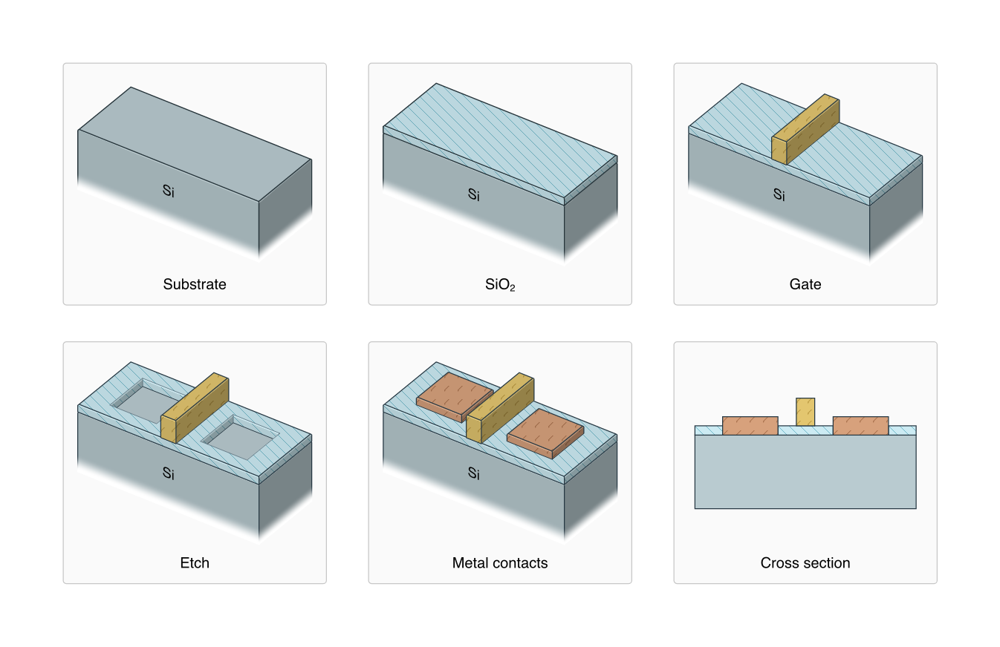

# Mesa

Draw 2D and 3D semiconductor devices and fabrication processes with
[CeTZ](https://github.com/cetz-package/cetz), including patterned geometry
loaded from GDS.



```typ
#import "@preview/mesa:0.1.0" as semi

#let sample = {
  import semi: *

  layer(
    "substrate",
    thickness: 40,
    material: "substrate",
    label: [Si],
  )
  layer(
    "oxide",
    thickness: 5,
    material: "dielectric",
    label: [SiO#sub[2]],
  )
  layer(
    "gate",
    thickness: 15,
    material: "metal",
    label: [gate],
  )
}

#semi.layer-stack(
  sample,
  camera: (azimuth: 35deg, elevation: 35deg),
  shading: "fancy",
)
```
